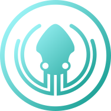
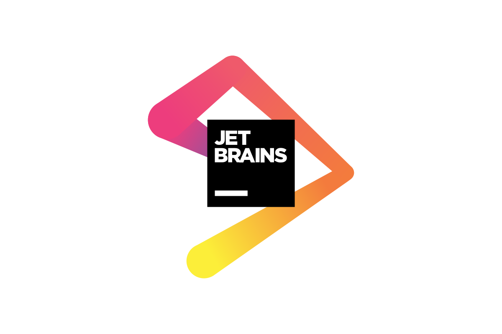

# Hi 👋, my name is Renaud and i'm a French IT student.

## My goal is to work in cybersecurity.

### My current programming languages (i'm still learning it):

### The tools that i use:

### The OS i already worked on:

