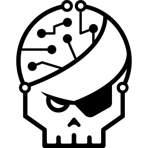

# Hi 👋, my name is Renaud and i'm a French IT student.

## My goal is to work in cybersecurity.

### My Projects:

I carried out a number of projects during my BUT, here is some of the most important:

The most important one is a web application for Legrand  

the implementation of network infrastructures with kathara.  

### My current programming languages (i'm still learning some of it):

### My current programming languages (i'm still learning some of it):

### My current programming languages (i'm still learning some of it):

### The tools that i use:

### The OS i'm familiar with:

### My Links (clickable image):

